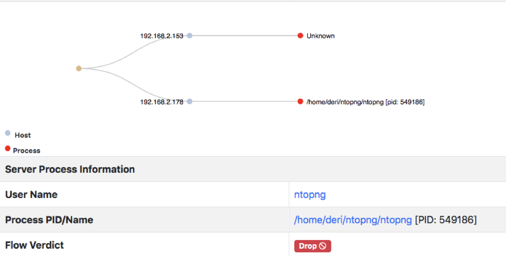
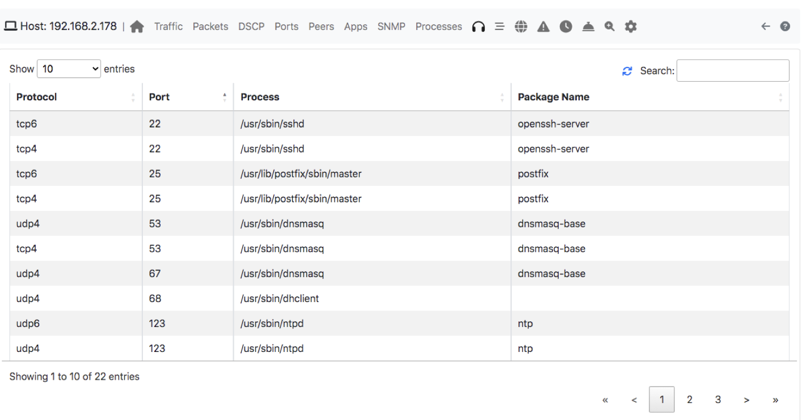

.. _RunningInagentMode:

Agent Mode support in nProbe
#############################

nProbe now supports integration with the operating system on Windows and Linux systems (eBPF based). This means that in addition to packet capture, nProbe can now report additional information about users and processes that have performed a given network activity.

Agent mode is enabled adding `--agent-mode` to the nProbe command line (it requires Enterprise license) on Linux and Windows operating systems.

In essence we now have additional information elements:

.. code:: bash
	  
	  [57640][Len 4] %SRC_PROC_PID                                          Flow source proc PID
	  [57641][Len 16] %SRC_PROC_NAME                                        Flow source proc name
	  [57897][Len 4] %SRC_PROC_UID                                          Flow source proc userId
	  [57844][Len 16] %SRC_PROC_USER_NAME                                   Flow source proc user name
	  [58012][Len 16] %SRC_PROC_PKG_NAME                                    Flow source proc package name
	  [58028][Len 32] %SRC_PROC_CMDLINE                                     Flow source proc cmdline args
	  [58030][Len 16] %SRC_PROC_CONTAINER_ID                                Flow source proc containerId
	  [57846][Len 16] %SRC_FATHER_PROC_NAME                                 Flow src father proc name
	  [58036][Len 4] %SRC_FATHER_PROC_UID                                   Flow src father proc UID
	  [57845][Len 4] %SRC_FATHER_PROC_PID                                   Flow source father proc PID
	  [58037][Len 16] %SRC_FATHER_PROC_USER_NAME                            Flow src father proc UID name
	  [58033][Len 16] %SRC_FATHER_PROC_PKG_NAME                             Flow src father proc package name
	  [57847][Len 4] %DST_PROC_PID                                          Flow dest proc PID
	  [57848][Len 16] %DST_PROC_NAME                                        Flow dest proc name
	  [57898][Len 4] %DST_PROC_UID                                          Flow dest proc userId
	  [57849][Len 16] %DST_PROC_USER_NAME                                   Flow dest proc user name
	  [58013][Len 16] %DST_PROC_PKG_NAME                                    Flow dest proc package name
	  [58029][Len 32] %DST_PROC_CMDLINE                                     Flow dest proc cmdline args
	  [58031][Len 16] %DST_PROC_CONTAINER_ID                                Flow dest proc containerId
	  [57850][Len 4] %DST_FATHER_PROC_PID                                   Flow dest father proc PID
	  [57851][Len 16] %DST_FATHER_PROC_NAME                                 Flow dest father proc name
	  [58039][Len 4] %DST_FATHER_PROC_UID                                   Flow dst father proc UID
	  [58040][Len 16] %DST_FATHER_PROC_USER_NAME                            Flow dst father proc UID name
	  [58035][Len 16] %DST_FATHER_PROC_PKG_NAME                             Flow dst father proc package name

	  
Integration with ntopng
~~~~~~~~~~~~~~~~~~~~~~~

The integration with ntopn is seamlessly via ZMQ. Example:

.. code:: bash

   nprobe -i eno1 --zmq tcp://127.0.0.1:1234 --agent-mode
   ntopng -i tcp://127.0.0.1:1234

Inside ntopng you can display process information in the flow view

as well know the list of open ports on the host where nProbe runs:

	  
Enforcing Process Traffic
~~~~~~~~~~~~~~~~~~~~~~~~~

Thanks to process visibility, nProbe can now report verdict about processes generating flows by means of a new information element that is also used in IPS-mode to report whether a flow should be dropped or pass.

.. code:: bash
	  
	  [NFv9 57994][IPFIX 35632.522][Len 2] %FLOW_VERDICT              Flow verdict marker (0 = unknown, 1=pass, 2=drop...)

The verdict is set to drop (2) whenever a local flow has been produced by a process that was not part of a Linux package (.apt or .rpm). This is because malware applications are often unpackaged and thus this is an indicator or a possible compromise. This is a Linux-only feature as Windows does not support packages.

