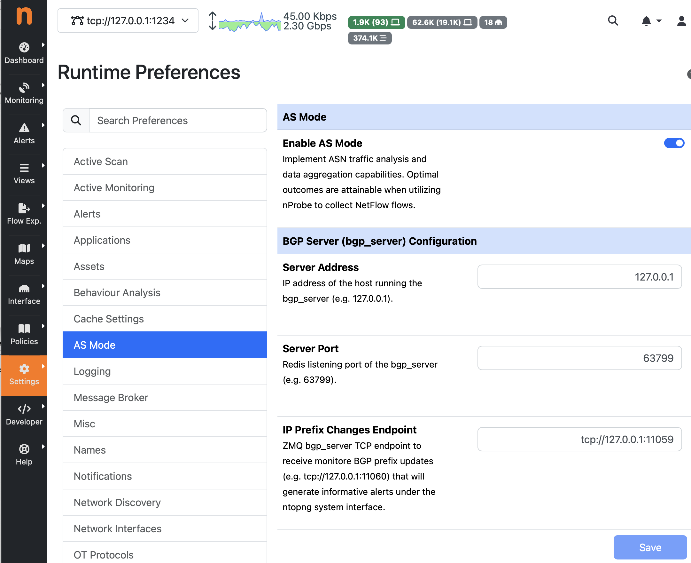

.. _BGP:

BGP/BMP Traffic Monitoring
##########################

BGP (Border Gateway Protocol) is the routing protocol that connects the global Internet by determining the paths data packets take between networks, while BMP (BGP Monitoring Protocol) is a separate, observational protocol used to safely stream real-time data about those BGP routing decisions to a centralized monitoring system.

BGP and BMP improve network visibility by transforming complex, hidden internet routing data into real-time, readable insights.While BGP generates the data that maps the internet, BMP acts as the window into that map, allowing network engineers to spot hidden routing errors, track external path changes, and prevent outages.

Starting with Enterprise M, nProbe integrates a new toold called bgp_server that implements both BGP and BMP protocols. As nProbe is a visibity tool, we have decided not to implement advertisements into the BGP protocol implementation so that ther is no risk that using bgp_server will advertise routes.

The bgp_server application is responsible for talking with one or more routers over BGP/BMP, receive the advertised routes and disribute them to applications such as nProbe that need to know more about traffic routing.

By establishing a peering session with actual network BGP routers, it maps traffic flows to their exact routing paths.

Core Responsibilities
---------------------

- BGP Peering: It acts as a lightweight BGP peer that establishes a session with your infrastructure's BGP routers to natively receive live routing updates.

- AS Path Extraction: It parses mandatory BGP attributes from those updates, specifically looking for the Autonomous System (AS) paths.

- Flow Enrichment: It passes this routing information to nProbe or ntopng. This allows the network analyzer to attach the first ten Autonomous Systems (AS-path) to both the client and server sides of every monitored network flow.

- Asymmetric Routing Visibility: Traditional tools like traceroute only track forward paths. The bgp_server framework helps map ingress (return) path routing, giving engineers visual clarity on how traffic is actually flowing across the internet.

To configure the bgp_server framework for your ntopng or nProbe deployment, you must complete a three-step configuration: allow passive BGP listening or active BMP, configure the execution arguments, and enable ZeroMQ delivery to pipe the AS data back to your monitoring dashboard.

Step 1: Configure Your Physical/Virtual BGP Router
--------------------------------------------------

Before starting the software daemon, configure your core network router (Cisco, Juniper, FRRouting, etc.) to treat your ntop server machine as a standard peer.

- BGP Version: Ensure it uses BGPv4.
- Peering Mode: Configure it as an Internal BGP (iBGP) or External BGP (eBGP) neighbor targeting the IP of your ntop collection server.
- Alternatively (BMP): If your router supports the BGP Monitoring Protocol (BMP), configure it to stream BMP data to your server on TCP port 11019.

  
Step 2: Launch bgp_server
-------------------------

Run the bgp_server binary tool from the command line. You can use the explicit binary arguments to specify your Autonomous System Number (ASN), routing flags, and the ZeroMQ queue socket. You can launch the application as ``service bgp_server start`` and specify the options on ``/etc/nprobe/bgp_server.conf``.

.. code:: bash
	  
	  # ZMQ stream for updates and withdraws
	  -z=tcp://127.0.0.1:11059
	  
	  # BGP Id (local IP address used for peering)
	  -i=10.82.4.121
	  
	  # BGP port (default 179)
	  -b=179
	  
	  # Private AS for peering
	  -a=65000
	  
	  # Monitored prefixes
	  -n=/etc/nprobe/prefixes.txt

Argument Breakdowns:

- -z <URL>: The ZeroMQ messaging publisher string. This sends parsed BGP data to your collector.
- -b <port>: The passive listening port for incoming BGP sessions (Default is 179). Change to 0 if you only want BMP.
- -p <port>: (Optional) The listener port for BMP stream collection (Defaults to 11019).
- -a <ASN>: The local AS number your ntop box will report during the initial BGP handshake.
- -i <IP>: The BGP Router ID string, input in dotted-decimal format.
- -v: Verbose mode, which outputs live parsed routing logs directly onto your terminal screen.
- -n: list of prefixes you want the bgp_server to monitor and report changes to monitoring application (e.g. ntopng). The file format is a list of prefixes (one per line) in CIDR format (both IPv4 and IPv6 are supported)/

Step 3: Link bgp_server to nProbe or ntopng
-------------------------------------------

To attach the captured AS paths to live flow graphics, you must instruct your traffic analytical interfaces to listen on the exact same ZeroMQ socket you established above. The bgp_server allows external application to query the collected routes using the redis protocol. For instance you can query it as follows using the redis-cli client application (use -r on bgp_server to specify the listening redis port):

.. code:: bash

	  $ redis-cli -p 63799
	  127.0.0.1:63799> info
	  bgp_server v.11.1.260620 for Ubuntu 24.04.4 LTS
	  127.0.0.1:63799> uptime
	  "22:03 sec"
	  127.0.0.1:63799> stats
	  1) "IPv4 prefixes            1,943,968"
          2) "IPv6 prefixes            466,439"
   	  3) "Total RIB entries        1,302,412"
	  127.0.0.1:63799> bgp
	  1) "[2a12:d8c0:ffff::201]:35411 [local AS=65000, BGP-ID=10.82.4.121] [Update: 95,759][Notification: 0][Keep-Alive; 45][Uptime: 22:10 sec]"
	  2) "10.255.255.201:44597 [local AS=65000, BGP-ID=10.82.4.121] [Update: 331,668][Notification: 0][Keep-Alive; 45][Uptime: 22:10 sec]"
  	  127.0.0.1:63799> bmp
	  (error) ERR no peers connected
	  127.0.0.1:63799> find 1.1.1.1
          "{\"1.1.1.0\\/24\": {\"217.197.106.201\": {\"best_entry\":true,\"asn\":204471,\"origin\":\"igp\",\"as_path\": [204471,13335],\"next_hop\":\"10.255.255.201\",\"communities\": [\"13335:10039\"]}}}"
			 

For nProbe Flow Collections add the ZeroMQ parameters to your network engine execution parameters:
``nprobe --zmq "tcp://*:5556" -i eth1 --bgp-server=127.0.0.1:63799:tcp://127.0.0.1:11059" -T "@NTOPNG@"``

The ntopng configurations can be specified inside the application preferences under the "AS Mode" section. The figure below shows a configuration example that matches the bgp_configuration shown earlier on this page:

	
If you want to read more about howto use BGP information in ntopng, please refer to this page https://www.ntop.org/guides/ntopng/asmode/index.html

