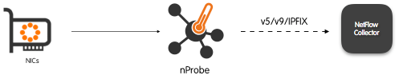
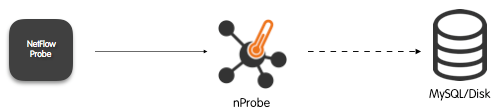
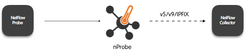
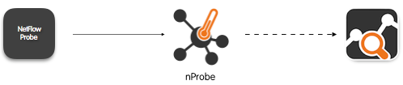

nProbe Modes
#####################

nProbe can be used in three modes, namely:

  - Probe
  - Collector (flow collection only, no Probe)
  - Relay
  - Proxy: Receive flows via NetFlow and emit them (optionally combining with captured traffic) to a remote collector.

Probe mode
----------

.. code:: bash

	  nprobe -i eth0 -n collector_ip:2055

  nProbe in Probe Mode

By default exported flows are sent over URL, but they can also collected over TCP and TLS. The syntax to use is <method>://<IP>:<port>.

Example:

  - -n 2055
  - -n udp://2055
  - -n tcp://2055
  - -n tls://2055
  - -n tls://192.168.2.25:2055

  
Collector mode
--------------

.. code:: bash

	  nprobe -3 2055

  nProbe in Collector Mode

By default flows are collected over URL, but they can also collected over TCP and TLS. The syntax to use is <method>://[<IP>:]<port>. In case the IP address is specified the collection port is bound only to the specified IP address instead to all interfaces of the host where nProbe runs.

Example:

  - -3 2055
  - -3 udp://2055
  - -3 tcp://2055
  - -3 tls://2055
  - -3 tls://192.168.2.25:2055

Relay mode
----------

.. code:: bash

	  nprobe -i none -n none -3 zmq://a.b.c.d:1234

Sometimes you need to collect (using a host in the private network) flows (over UDP) from devices located on the Internet/DMZ, and you want to avoid making a hole in your firewall for security reasons. In this case you need a flow relay that is basically an application deployed on the public Internet that acts as a rendez-vous point.

Suppose to have deploy the flowRelay on host with public IP a.b.c.d listening for incoming flows on port 2055, and nProbe on host e.f.g.h. All you need to do is:

  - [host a.b.c.d] flowRelay -c 2055 -z "zmq://a.b.c.d:1234c"
  - [host e.f.g.h] nprobe -i none -n none -3 zmq://a.b.c.d:1234

.. note::
   
    The flowRelay application is part of the nProbe package.

Proxy mode
----------

.. code:: bash

	  nprobe -3 2055 -n collector_ip:2055 -V 9

  nProbe in Proxy Mode

In proxy mode you can convert from NetFlow v5 v9/NetFlow Lite/sFlow/IPFIX/jFlow to NetFlow v5, v9 or IPFIX in order to smoothly upgrade to newer netflow protocol versions while capitalizing on previous protocol versions. So you can for instance convert flows coming from your v5 router into IPFIX and vice-versa. Note that with some combinations (e.g. from v9 to v5) you might loose some flow information. In this mode collected flows are converted to an internal flow representation, put in cache, and then exported according to the default or -T, if specified.

Proxy mode with Collector PassThrough
-------------------------------------

.. code:: bash

	  nprobe -3 2055 --collector-passthrough --zmq tcp://192.168.1.200:5678

  nProbe in Proxy Mode with Collector PassThrough

Similar to proxy mode but much faster as flows are not put in cache but converted for export via ZMQ, Syslog, and Kafka (via the export plugin). In this case the flow structure is preserved, -T is ignored, and flow is exported in JSON format as is without any conversion. This mode is recommended when you want to collect flows from NetFlow/IPFIX/sFlow and send them to a JSON-based consumer.
