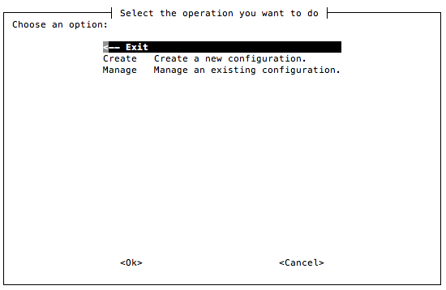
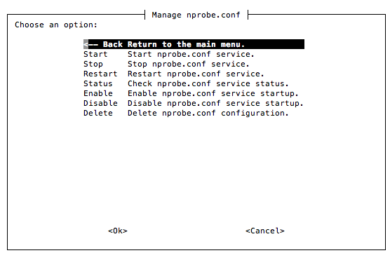

How to Start nProbe
###################

Systemd-based Systems
---------------------

The nProbe service is controlled using the systemctl utility on operating systems and distributions that use the systemd service manager.

Upon successful package installation, the nProbe service is automatically started on the loopback interface, and it is also started on boot by default. 
The service can be disabled as explained in the next sections to prevent this behavior.

Configuration Files
===================

The default service uses a configuration file that is located at /etc/nprobe/nprobe.conf and that is populated with some defaults during installation. 
The configuration file can be edited and extended with any configuration option supported by nProbe. 
A service restart is required after configuration file modifications.

Multiple nProbe instances can be simultaneously executed on the same machine. Typically, each instance is bound to an interface. 
To allow different nProbes to be run with independent configurations, multiple configuration files co-exist under the directory:

.. code:: bash

   /etc/nprobe/

Each configuration file starts with "nprobe-" and ends with a suffix corresponding to the interface name it is associated to, exception made for
the default nProbe service, corresponding to the configuration file nprobe.conf. For example, assuming three different nProbe daemons have to be 
run independently for eth0, eth4, and myri0, in addition to the default service, the following configuration files should be present:

.. code:: bash

   # ls -lha /etc/nprobe/
   total 28K
   4.0K -rw-r--r--   1 root root  211 Mar 15 17:54 nprobe.conf
   4.0K -rw-r--r--   1 root root  211 Mar 15 17:54 nprobe-eth0.conf
   4.0K -rw-r--r--   1 root root  195 Jan  8 17:17 nprobe-eth4.conf
   4.0K -rw-r--r--   1 root root  215 Jan  8 17:22 nprobe-myri0.conf

When nProbe is used in probe mode it is not bound to any interface as its job is to collect NetFlow from some other device.
In this case the configuration file to be created is:

.. code:: bash

   nprobe-none.conf

Editing Configuration Files
===========================

People familiar with editors, can create and modify the configuration files. However for the rest of us there is a Linux-only tool part of the nProbe package and named :code:`nprobe-config` that allows you to edit configurationf files interactively. You need to start it as superuser (or sudo nprobe-config) and follow the instructions on the screen. Below you can find two examples of how the tool works

Automatic Startup
=================

To start, stop and restart the default nProbe service type:

.. code:: bash

   systemctl start nprobe
   systemctl stop nprobe
   systemctl restart nprobe

To prevent nProbe from starting on boot type:

.. code:: bash

   systemctl disable nprobe

Or to start nProbe on boot, assuming it has previously been disabled, type:

.. code:: bash

   systemctl enable nprobe

To check the status of the service, including its output and PID, type:

.. code:: bash

   systemctl status nprobe

To control additional services, based on the interface name specified in the configuration file name as described in the
previous section, the 'nprobe@<interface>' service should be used, example:

.. code:: bash

   systemctl enable nprobe@eth0
   systemctl start nprobe@eth0

init-based Systems
------------------

The nProbe service can be controlled on old init-based systems by means of the script script located at:

.. code:: bash

   /etc/init.d/nprobe

In order to launch nProbe daemons automatically on system startup, empty files ending with “.start” must be created in the same directory of the configuration files. 

.. code:: bash

   # ls -lha /etc/nprobe
   -rw-r--r--   1 root root  211 mar 15 17:54 nprobe-eth0.conf
   -rw-r--r--   1 root root    0 mar 17 15:44 nprobe-eth0.start

Those configurations can be controlled with the script /etc/init.d/nprobe. The script accept different options and one or more interface names as input. Calling the script without options yields the following brief help

.. code:: bash

   sudo /etc/init.d/nprobe
   
   Usage: /etc/init.d/nprobe {start|force-start|stop|restart|status} [interface(s)]

The options and the usage of the daemon control script is discusse below.

*start*

This option is used to start daemon nProbes for interfaces that have a “.start” file. Calling start on interfaces with missing “.start” files yield and error. For example

.. code:: bash

   # ls -lha /etc/nprobe
   -rw-r--r--   1 root root  211 mar 15 17:54 nprobe-eth0.conf
   -rw-r--r--   1 root root    0 mar 17 15:44 nprobe-eth0.start
   -rw-r--r--   1 root root  195 Jan  8 17:17 nprobe-eth4.conf
   -rw-r--r--   1 root root  215 Jan  8 17:22 nprobe-myri0.conf
   # /etc/init.d/nprobe start eth0
   Starting nProbe eth0
   # /etc/init.d/nprobe start eth4
   nProbe eth4 not started: missing /etc/nprobe/nprobe-eth4.start

*force-start*

This option is used to start daemon nProbes for instances that do not have a “.start” file. Calling force-start on interface eth4 shown in the example above doesn’t raise any error and the daemon is properly started

.. code:: bash

   # /etc/init.d/nprobe force-start eth4
   Starting nProbe eth4

*stop*

This option is used to stop an nProbe daemon instance. For example 

.. code:: bash

   # /etc/init.d/nprobe stop eth4
   Stopping nProbe eth4

*restart*

This option causes the restart of a daemon associated to a given interface, e.g., 

.. code:: bash

   # /etc/init.d/nprobe restart eth0
   Stopping nProbe eth0
   Starting nProbe eth0

*status*

This options prints the status of a daemon associated to a given interface, e.g., 

.. code:: bash

   # /etc/init.d/nprobe status eth0
   
   nprobe running

Running nProbe on Windows
-------------------------

nProbe can be activated either as service or as application (i.e. you can start it from cmd.exe). The nProbe installer registers the service and creates an entry on the Start menu. In order to display nProbe inline help, the executable must be run with /h

.. code:: bash

	  C:\Program Files\nProbe>nprobe /h

Available options:

  - \/i <service name> [nprobe options] Install nprobe as service
  - \/c [nprobe options]                Run nprobe on a console
  - \/r <service name>                  Deinstall the service

Example:
Install nprobe as a service: :code:`nprobe /i my_nProbe -i 0 -n 192.168.0.1:2055`
Remove the nprobe service:   :code:`nprobe /r my_nProbe`

Notes:

  - Type 'nprobe /c -h' to see all options
  - In order to reinstall a service with new options it is necessary to first remove the service, then add it again with the new options.
  - Services are started/stopped using the Services control panel item.
  - You can install the nProbe service multiple times as long as you use different service names.

The full list of options is available with nprobe /c -h. If nProbe is started on the console, the /c flag needs to be used (e.g. nprobe /c --n 127.0.0.1:2055).

Specify Monitored Interfaces
============================

As network interfaces on Windows can have long names, a numeric index is associated to the interface in order to ease the nProbe configuration. The association interface name and index is shows typing the ‘nprobe /c --h’

.. code:: bash

	  C:\ntop\nprobe\Debug>nprobe.exe/c -h

	  Available interfaces:
          [index=0] 'Adapter for generic dialup and VPN capture'
          [index=1] 'Realtek 8139-series PCI NIC'

For instance, in the above example the index 1 is associated to the interface Realtek 8139-series PCI NIC, hence in order to select this interface nprobe needs to be started with --i 1 option.

Execution as a Windows Service
==============================

Windows services are started and stopped using the Services application part of the Windows administrative tools. When nProbe is used as service, command line options need to be specified at service registration and can be modified only by removing and adding the service. The nProbe installer registers nProbe as a service with the default options. If you need to change the nProbe setup, you need to do as follows:

.. code:: bash

	  nprobe /r	Remove the service
	  nprobe /i <put your options here>	Install the service with
	  the specified options.
