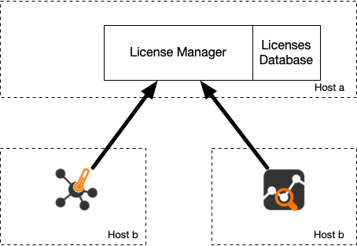

Introduction
############

Traffic measurements are necessary to operate all types of IP networks. Networks admin need a detailed view of network traffic for security, accounting and management reasons. The compositions of the traffic have to be analyzed accurately when estimating traffic metrics or when finding network problems. All of these measurements have to be made by analyzing all the packets flowing to the central points in the network (such as router and/or switches). The analysis could be done on the fly or by logging all the packets and then post-processing them. But with the increasing network capacities and traffic volumes this kind of approach is not very efficient. Instead similar packets (packets with a set of common properties) can be grouped together composing flows. As an example, a flow can be composed of all flowing packets that share the same source and destination address so a flow can be derived using only some fields of a network packet. This way, similar types of traffic can be stored in a more compact format without loosing the information we are interested in. This information can be aggregated in a flow datagram and exported to a collector able to report network metrics in a user-friendly format.   
When collected this information provides a detailed view of the network traffic. 

Precise network metric measurements is a challenging task so a lot of work has been done in this filed. In commercial environments, NetFlow is probably the de-facto standard for network traffic accounting and billing. NetFlow is a technology originally created by Cisco in 1996 and is now standardized as Internet Protocol Flow Information eXport (IPFIX -- RFC 3917). NetFlow is based on the probe/collector paradigm. The probe, usually part of network appliance such as a router or a switch, is deployed on the measured network segment, it sends traffic information in NetFlow format towards a central collector. 

What is nProbe?
###############

nProbe ia a software application able to:

- Capture packets and emit them in flow (NetFlow v5/v9/IPFIX) format.
- Collect NetFlow/IPFIX flows (e.g. produced by a network router).
- Collect sFlow flows (e.g. produced by a network switch).
  
It is available for most of the OSs on the market (Windows, BSD, Linux, macOS). When installed on a PC, nProbe turn it into a Network-aware monitoring appliance.

Its main purpose is to:

- Preprocess flows/packets and `deliver them to ntopng <using_with_ntopng.html>`_.
- Emit processed information sending it to a remote collector or database/disk storage.

In packet collector mode, nProbe has been designed for network up to 10 Gbit sitting on top of `PF_RING <https://www.ntop.org/products/packet-capture/pf_ring/>`_. For 10+ Gbit networks, you should consider `nProbe Cento <https://www.ntop.org/products/netflow/nprobe-cento/>`_ that is designed for high-speed networks. 
  
This manual aims at describing how to use nProbe, deploy it in networks, and how to develop plugins for extending it functionalities.

Installation
============
Installation instructions can be found at
http://packages.ntop.org/. Nightly and stable builds are
available. Stable builds are intended for production environments whereas
nightly builds are intended for testing.


Windows Notes
-------------

The nProbe installer comes without capture drivers. You need to
install manually `npcap drivers <https://nmap.org/npcap/>`_ **BEFORE** you install nProbe.
If Wireshark is already installed on Windows, then npcap drivers
are already installed and no driver installation is necessary.

During npcap installation you need to select "Install Npcap in WinPcap API-compatible Mode".
In case you see a message as the one below
 
.. figure:: ./img/missing_pcap.png

it means that your capture drivers have not been properly installed and that you have to install them as described in this section.

.. _licensing:

Licensing
---------
Binary nProbe instances require a per-server license that is released according to the EULA (End User License Agreement). Each license is perpetual (i.e. it does not expire) and it allows to install updates for one year since purchase/license issue. This means that a license generated on 1/1/2022 will be able to activate new versions of the software until 31/12/2022. If you want to install new versions of the software release after that date, you need to purchase a new license or avoid further updating the software. For source-based nProbes you still have to obey to the nProbe license listed in appendix.

nProbe licenses are generated using the orderId and email you provided when the license has been purchased on the ntop shop. The license page is accessible at https://shop.ntop.org/mklicense/. On such page you need to specify the nprobe systemId and version. You can obtain such information with :code:`nprobe --version` (Linux) or :code:`nprobe /c --version` (Windows). On Linux the nProbe binary is installed under :code:`/usr/bin/` whereas on Windows on :code:`C:/ProgramFiles/nProbe`.

Plugins
~~~~~~~

Plugins are add-ons that add enhanced packet dissection and analysis for specific protocols.
They are unlocked based on the nProbe license. For instance nProbe Enterprise S enables HTTP and DNS plugins.
Please check the Comparison Table section for a comparison between versions, or the nProbe Plugins section 
to learn more about plugins.

Applying the License
--------------------

Once the nProbe license has been generated, it can be applied in order for
nProbe to become fully-functional.

Using the License Manager
-------------------------

In addition to standard per-server licenses, it is possible to centralize licenses on a license manager (LM) application that is part of the `ntop-license` package.



This application needs to be installed on a network host of your LAN that is stable from the systemId standpoint (i.e. installing it on a container is probably not a good idea) meaning that the host and the management NIC of the host where the LM run should not change.

The LM application is installed by the ntop-license package that runs it as a service. The first thing you need to do is to install your licenses in the LM license directory that is typically /etc/ntop/license_manager. Note that the LM licenses are different from standard licenses, so make sure you ask for/install LM licenses as others will not be recognized. Once the LM is started, it listens on a network for applications willing to validate licenses.

In order to use the LM for validating the license you

- do not need to install a nProbe standard license
- you need to start nProbe adding the following CLI option ```--license-mgr <license manager>.conf```. Example ```nprobe -i eth1 --license-mgr <license manager>.conf```.

If license validation is successful, nProbe will be permanently connected to the LM meaning that the used license cannot be used by another nProbe application. As soon as the application terminates the licenses can now be used by another nProbe instance eventually running on a different host.

LM configuration files have the folowing format

.. code:: bash
	  
	  LICENSE_MANAGER=127.0.0.1:9999

	  #
	  # Unique instance name
	  #
	  INSTANCE_NAME=dummy instance

	  #
	  # User authentication token
	  #
	  AUTH_TOKEN=fjfgsfgsj

	  #
	  # nprobe ntopng
	  #
	  PRODUCT_FAMILY=nprobe

	  #
	  # pro enterprise_s enterprise_m enterprise_l enterprise_xl
	  #
	  PRODUCT_EDITION=enterprise_m


where

- LICENSE_MANAGER is the IP and port of the host where the LM is running.
- INSTANCE_NAME is a string used to indetity this specific instance
- AUTH_TOKEN is a token that the LM can use to prevent issuing valid licenses for unknown AUTH_TOKEN. Its value must be configured in the LM.
- PRODUCT_FAMILY and PRODUCT_EDITION define what license the ntop application will as the LM when contacting it.

  
The main difference between standard licenses and LM licenses are:

- Standard licenses are bound to a specific host making impossible to use the license on a host other than the one for which the license was generated. With the LM licenses are bound to the host where the LM runs (that's why its systemId should not change) that distributes them to ntop applications regardless of where they run.
- The LM allows to centralize licenses on a single place simplifying maintenance and license updates.
- If ntop applications are unable to communicate with the LM (e.g. lack of connectivity) the ntop application (e.g. nProbe) will try to reconnect a few times, an in case of failure it will terminate the application. This mean that you should use the LM only if you are confident that your network is not affected by connectivity problems.
- The LM allows you to share licenses acros multiple hosts. This means that (not simultaneously) you can use nProbe on host A and host B, thing that was not possible with standard licenses.

  

Linux
~~~~~
On Linux, the license must
be placed in a one-line file :code:`/etc/nprobe.license`. On Windows,
the license must be placed in a one-line file in the nProbe
installation directory which is typically :code:`C:/Program
Files/nProbe`.

Windows
~~~~~~~
To create this one-line file on Windows, open the
Notepad as an administrator and paste the generated license key. Then
select "File->Save as", specify :code:`nprobe.license` as file name and
save it in the nProbe installation directory. Make sure the file name
has no extension (e.g., :code:`.txt`) by selecting "Save as Type: All Files".

.. note::

   A nProbe restart is recommended once the license has been applied
   to make sure all the new functionalities will be unlocked.

