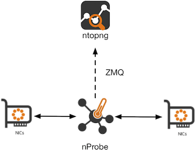
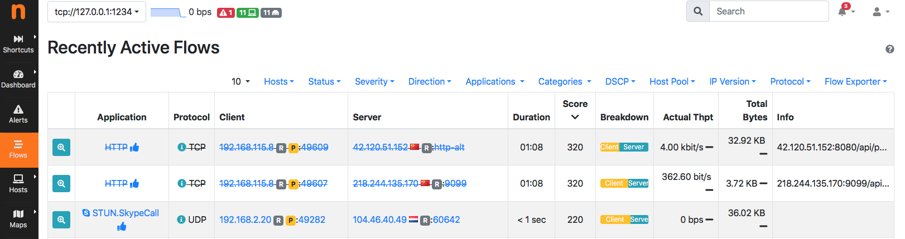

.. _RunningInIPSMode:

Running nProbe in IPS Mode
##########################

nProbe *9.5.210610* and later features a new IPS mode. This means that
it is possible to run nProbe inline as a transparent bridge and block
selected traffic based on configured traffic policies.

In this setup you can combine network visibility offered by ntopng with the
ability to enforce policies and block threats offered by nProbe when running in IPS mode.

IPS Use Cases
-------------

Typical use cases include:

- Ability to cluster omogenerous hosts in pools to which a specialised policy can be applied
- Block traffic based on the application protocol (DPI). Example: block BitTorrent traffic.
- Allow/block access based on the country or region, Example: allow SSH access to server 1.2.3.4 only from Italy.
- Block connections that have security issues. Example: block TLS connections with invalid certificates.
- (Linux only) Assign a maximum bandwidth to selected protocols. Example: assign 10 Mbit of bandwidth to NetFlix.

IPS and ntopng
--------------

nProbe in IPS mode is integrated with ntopng that can act as:

1. a monitoring console for visualising policed traffic.
2. a policy configurator for generating traffic policies.

Traffic Monitoring
~~~~~~~~~~~~~~~~~~

nProbe and ntopng have been enhanced to report information about policed traffic. Flows that
are not allowed (i.e. dropped in the IPS policies) are depicted with a strikethrough line so
that you can immediately see what traffic has been dropped and what instead is flowing
in the network.

The integration is seamlessly via ZMQ. Example:

.. code:: bash

   nprobe --zmq tcp://*:1234 --ips-mode /etc/nprobe/ips-rules.conf -i nf:0
   ntopng -i tcp://127.0.0.1:1234

In the above example, policies are defined in */etc/nprobe/ips-rules.conf* according to
the format described later in this guide.

Policy Configuration
~~~~~~~~~~~~~~~~~~~~

As an alternative to the manual policy configuration by means of a configuration file,
ntopng can be used to configure policies and automatically export them to nProbe through
a ZMQ channel. This can be configured by setting the *--ips-mode* parameter to *none* and
using the *--zmq-publish-events* option to configure the ntopng ZMQ endpoint for IPS
events. Example:

.. code:: bash

   nprobe --zmq tcp://*:1234 --ips-mode none --zmq-publish-events tcp://127.0.0.1:5557 -i nf:0
   ntopng -i tcp://127.0.0.1:1234 --zmq-publish-events tcp://*:5557

Please refer to the ntopng documentation for more details about the `Host Pools and Traffic Policies <https://www.ntop.org/guides/ntopng/web_gui/pools.html>`_
configuration using the web GUI.

FreeBSD vs Linux IPS Implementation
-----------------------------------

IPS mode is available for both Linux and FreeBSD (including OPNsense and pfSense) operating
systems and while the command line and configuration file is seamless across platforms its
operating mode is totally different.

On Linux, nProbe leverages on NetFilter for speaking with the bridging system: in essence via
NF_QUEUE the kernel sends nProbe packets to be analyzed/policed. nProbe makes a verdict on such
packets and reports it to the operating system that will handle packets belonging to
such flow in the kernel instead of sending them to nProbe for forwarding.
This guarantees maximum performance as only the first few packets
(typically until nDPI detects the application protocol) are delivered to nProbe while the rest is
processed inside the kernel. Combining this with multi-queue, it boosts the nProbe performance that
outperforms the typical figures of the vanilla bridge infrastructure.

On FreeBSD this facility is not available, and thus nProbe needs to bridge packets in userspace
by reducing the performance. The nProbe product page reports typical performance figures.

Policies Configuration
----------------------
	
Different traffic policies can be applied to different hosts by defining 
pools of hosts based on IP, subnet (CIDR), MAC address. Based on the nProbe
version it is possible to specify a variable number of rules: please refer
to the nProbe product page for more details about these limits.

Traffic policies include:

- Traffic blocking based on the application protocol.
- Traffic blocking based on *risks* detected by the DPI library.
- Traffic blocking based on GeoIP information including Country and Continent.
- Traffic blocking or shaping based on Layer-7 categories.

In order to enable *IPS mode* in nProbe, a configuration file containing
the policies definitions in JSON format should be provided using the *--ips-mode*
parameter. 

The configuration file should contain:

1. The pools definition section, where each pool defines:

- An *id*, which is a numeric and unique identifier for the pool
- A *name* for the pool
- A list of MAC addresses
- A list of IP or subnets (CIDR format)
- The *id* of the *policy* to be applied to the pool

Example:

.. code:: json

   { "pool": { "id":1, "name": "my pool 1", "mac": [], "ip":  [ "192.168.1.0/24"] }, "policy": { "id": 1 }}

2. The policies definition section, where each policy defines:

- An *id*, which is a numeric and unique identifier for the policy 
- A *name* for the policy
- A *default_marker* which defines the default action for traffic
- A *flow_risk* configuration which defines what traffic matching risks should be dropped
- A *markers* section which defines policies based on *protocols* and *categories*

The action can be *pass*, *drop* or a marker (number) that can be used to apply shaping
policies when NetFilter is used (see the next section *IPS Mode on Linux*). 
Markers 1 and 2 are used by the *pass* and *drop* actions respectively.

A policy definition can inherit from another policy, in fact it is a good practice 
to define a global *root* policy with *id* 0 and define specific policies for eaach 
pool as in the below example.

Example:

.. code:: json

   { "policy": { "id": 0, "name": "root rule", "default_marker": "pass", "flow_risk": { "bitmap": 12321, "marker": "drop" }, "markers": {"protocols": {}} }}
   { "policy": { "id": 1, "name": "root rule", "default_marker": "pass", "markers": {"protocols": { "Facebook": "drop" }}, "categories": { "29": "drop" }}}

3. Additional settings, including:

- Custom L7 protocols definition (to extend the built-in nDPI protocols)
- Categories definition (e.g. to handle list of Malwares)
- Path of the GeoIP database files (used to filter based on Country/Continent/AS)

Example:

.. code:: json

   { "custom_protocols": "/etc/nprobe/protos.txt" }
   { "category_file": "/etc/nprobe/lists/nfw_malware_list.txt" }
   { "category_file": "/etc/nprobe/lists/nfw_mining_list.txt" }
   { "geoip": { "asn": "/data/dbip-asn-lite-2021-04.mmdb", "city": "/data/dbip-city-lite-2021-04.mmdb" }}

Full example:

.. code:: json

   ### Pool definition ###
   { "pool": { "id":1, "name": "my pool 1", "ip":  [ "192.168.0.1/24", "10.0.0.0/8", "2a03:b0c0:2:d0::360:4001/48"], "mac": [] }, "policy": { "id":1 }}
   { "pool": { "id":2, "name": "my pool 2", "mac": ["e8:06:88:ff:fe:e4", "02:81:27:b5:f9:f3", "00:01:01:e4:ba:2c"],  "ip":  ["172.16.0.0/16"] }, "policy": { "id":2 }}
   { "pool": { "id":3, "name": "my pool 3", "ip":  [ "131.114.0.0/16" ], "mac": [] }, "policy": { "id": 3 }}
   
   ### Policy definition ###
   # Continents: Africa / Asia-Pacific / Europe / North America / South America
   
   # Root rule
   { "policy": { "id": 0, "name": "root rule", "default_marker": "pass", "flow_risk": { "bitmap": 12321, "marker": "drop" }, "markers": { "protocols": { "TLS": "pass" }}}}
   
   # Rules definition (son of rule 0)
   { "policy": { "id": 1, "root": 0, "name": "my rule 1", "default_marker": "pass", "markers": { "categories": { "29": "drop" }, "protocols": { "HTTP": "pass" }, "countries": { "IT": "pass", "CN": "drop" }, "continents" : { "Asia" : "drop"}}}}
   { "policy": { "id": 3, "root": 0, "name": "my rule 3", "default_marker": "pass", "markers": { "protocols": { "HTTP": "drop" }}}}
   
   # Subrule of rule 1 (with more restrictions)
   { "policy": { "id": 2, "root":1, "name": "my subrule 2 (son of rule 1)", "default_marker": "drop", "markers": { "protocols": { "53": "pass" }}, "hostnames": { "fundingchoicesmessages.google.com": "pass", "www.gstatic.com": "drop", "www.youtube.com": "pass" }}}
   
   ### Custom protocols definition ###
   { "custom_protocols": "/etc/nprobe/protos.txt" }
   
   ### Category files ###
   { "category_file": "/etc/nprobe/lists/nfw_malware_list.txt" }
   { "category_file": "/etc/nprobe/lists/nfw_mining_list.txt" }
   
   ### GeoIP ###   
   { "geoip": { "asn": "/data/dbip-asn-lite-2021-04.mmdb", "city": "/data/dbip-city-lite-2021-04.mmdb" }}

IPS Mode on Linux
-----------------

The *IPS mode* on Linux is based on NetFilter and requires a Linux bridge configuration. Part of the nProbe package, you can find
simple configuration files in /usr/share/nprobe/netfilter/scripts/ including:

- *policy_simple.sh* : simple policy implementation that shows how to divert UDP traffic to nProbe via NF_QUEUE. All the remaining traffic will be unpoliced. This script is designed to run on a stand-alone host.
- *policy_and_bridge_simple.sh* : simple implementation to transparently bridge two network interfaces. This script creates a bridge between two configurable interfaces, and sends their traffic to nProbe via NF_QUEUE.
- *policy_on_bridge.sh* : example of configuration on a host that is used to transparently bridge network interfaces. This is a typical setup for creating a transparent traffic policer. AS you can read in the script, you need to specify the name for LAN, WAN and BRIDGE devices. This script allows you to silently drop traffic when it does not match the traffic policies.
- *policy_with_shaper.sh* : same as the previous script with the different that it setups also traffic shaping for assigning traffic to shapers. This script allows you to both drop unwanted traffic and shape allowed traffic.

Please find below a simple NetFilter configuaration creating a queue with ID 0 and diverting DNS traffic to it:

.. code:: bash

   iptables -F
   iptables -t nat -F
   iptables -t mangle -F
   iptables -A OUTPUT -p icmp -j NFQUEUE --queue-num 0 --queue-bypass
   iptables -A OUTPUT -p udp --sport 53 -j NFQUEUE --queue-num 0 --queue-bypass
   iptables -A OUTPUT -p udp --dport 53 -j NFQUEUE --queue-num 0 --queue-bypass

As previously stated, sample scripts for configuring NetFilter are installed by the nProbe package under */usr/share/nprobe/netfilter/scripts*.
Please check the help (run the script with the *-h* parameter) for a description about the script functionalities. All the 
scripts have support for specifying the interfaces via parameters: *-W <WAN interface>*, *-L <LAN interface>*, *-B <bridge interface>*.
Additional configuration may be available in the script itself, it is recommended to take a look at, and eventually modify, the
script code according to the use case.

After configuring NetFilter, it is possible to start nProbe on the NetFilter interface by using nf:ID as interface name (in other words please configure NetFilter first and then start nProbe)..

Example of nProbe configuration:

.. code:: bash

   -i=nf:0
   -n=none
   --zmq=tcp://*:5556
   -T="@NTOPNG@"
   --ips-mode=/etc/nprobe/ips-rules.conf

.. note::

   On Linux (but not on FreeBSD) when you configure NetFilter rules to forward in kernel all packets that have been already marked by nProbe, such packets are invisbile to nProbe.
   This is because such packets are not observed by nProbe as they are hanled in kernel. In this case when attaching ntopng to nProbe, the traffic volumes
   reported by ntopng are smaller than the traffic that has flown in the network.

FreeBSD/OPNsense/pfSense
------------------------

The *IPS mode* on FreeBSD does not require a special configuration, it is only required
to specify in nProbe as interface the one where policies should be applied.
Please visit the :ref:`OPNsenseIntegration` and :ref:`pfSenseIntegration` sections for
further information about the configuration.

