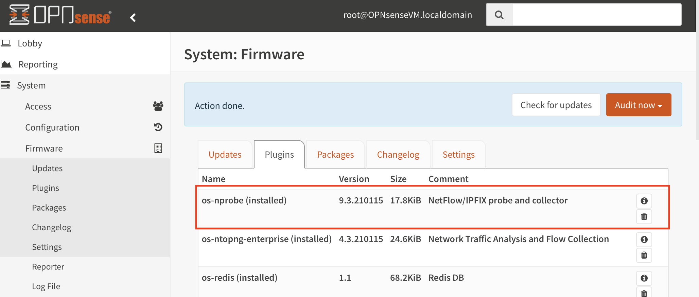
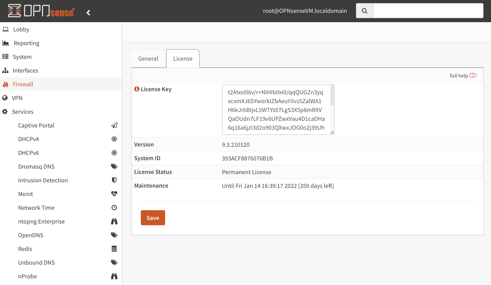
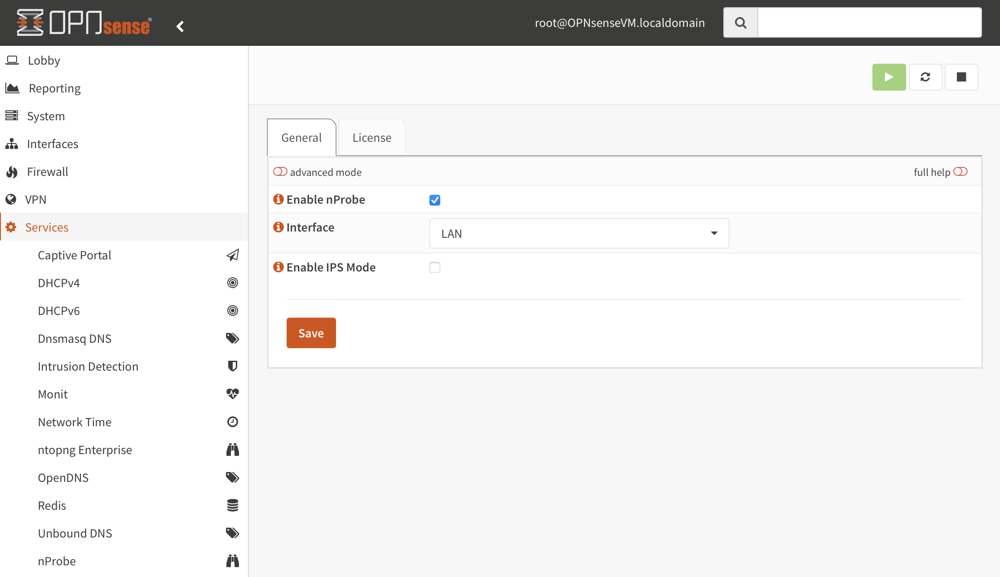
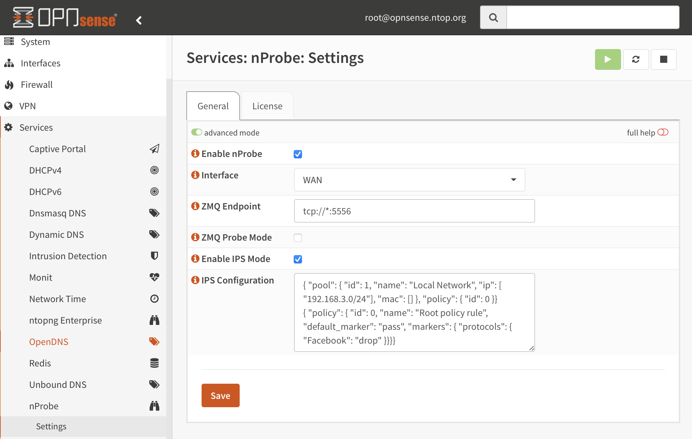

.. _OPNsenseIntegration:

OPNsense
########

nProbe can be installed on OPNsense as plugin using the Web interface (recommended)
or using the command line. In both cases the ntop repository for FreeBSD should be
configured as described at https://packages.ntop.org/FreeBSD/.

Repository Configuration
========================

Log into the OPNsense Shell as administrator (select option 8).

.. figure:: ../img/opnsense_shell.png
  :align: center
  :alt: OPNsense Shell

  OPNsense Shell

And install the repository using the command provided at https://packages.ntop.org/FreeBSD/
(you can cut&paste the command below).

.. code:: bash

   pkg add https://packages.ntop.org/FreeBSD/FreeBSD:13:amd64/latest/ntop-1.0.pkg

.. note::

   On older OPNsense versions the package prefix is .txz so the command will be  pkg add https://packages.ntop.org/FreeBSD/FreeBSD:12:amd64/latest/ntop-1.0.txz

   
The output should look like the below.

.. figure:: ../img/opnsense_repo_installation.png
  :align: center
  :alt: ntop Repo Installation

  ntop Repository Installation

Plugin Installation
===================

.. note::

   Plugins installation in OPNsense requires you to log in as administrator.

Go to the *System* > *Firmware* > *Plugins* page and click on the *Check for updates*.

.. figure:: ../img/opnsense_check_for_updates.png
  :align: center
  :alt: Check for updates

  Plugins - Check For Updates

The *os-nprobe* plugin should appear in the list and can be installed by
clicking on the *+* symbol.

  nProbe Plugin Installation

License Configuration
=====================

Go to *Services* > *nProbe* > *Settings* > *License* to get all the information required
by the license generator (*Version* and *System ID*).

  nProbe Info

The license can be installed through the same page by pasting it in the *License Key*
box and saving the configuration. The service should be restarted in the *General* page.

nProbe Configuration
====================

Going to *Services* > *nProbe* > *Settings* > *General* it is possible to configure
the nProbe service. A basic configuration usually includes the below steps:

  1. Enable the service by checking *Enable nProbe*
  2. Select the capture *Interface*

  nProbe Configuration

Save the configuration and run the service.

By default nProbe listens for collectors over ZMQ on a default port. Select the *advanced mode*
to change the port or to enable the *Probe Mode* which is usually useful when deploying nProbe
behind a NAT/Firewall, to let it connect to the collector as a client.

Please note that it is possible to use nProbe to deliver traffic information to a local ntopng
instance by installing the *os-ntopng-enterprise* plugin and enabling the *Connect to nProbe*
flag in the *ntopng Enterprise* plugin configuration page. Please take a look at the
`ntopng plugin guide <https://www.ntop.org/guides/ntopng/third_party_integrations/opnsense.html>`_
for further information.

IPS Mode
--------

nProbe *9.5.210422* and later features a new IPS mode which is described in :ref:`RunningInIPSMode`.
It is possible to enable this mode from the same configuration page under
*Services* > *nProbe* > *Settings* > *General* by enabling the *Enable IPS Mode* checkbox.

In order to configure traffic policies, enter *advanced mode* by toggling the top-left button in
the same page, and use the *IPS Configuration* box to add the configuration as shown in below picture.

  IPS Mode Configuration

After that just *Save* and restart the nProbe service, no additional action is required.
Please read the :ref:`RunningInIPSMode` section for learning more about the IPS configuration.
