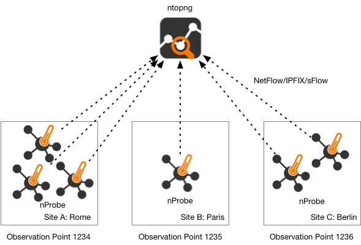

Tuning nProbe Performance
#########################

As nProbe can be deployed on very different environments, it is necessary to tune it according to the network where is active. In order to achieve a good probe setup, it is necessary to understand how nProbe is working internally. Each captured packet is analyzed, associated to a flow, and stored onto a hash. Periodically, the hash is analyzed and expired flows are emitted. The hash size is static (-w flag) as this allows nProbe to:
Allocate all the needed memory at startup (this is compulsory on embedded systems where memory is limited and it is necessary to know at startup whether a certain application can operate with the available resources).
Avoid exhausting all the available memory in case of attacks that can produce several flows.
Selecting the hash size is a matter of trade-off between efficiency (an efficient hash is at least 1/3 empty) and memory usage. This statement does not mean that a huge hash is always the solution as the flow export process can be slower (and more CPU cycles are needed) as a large hash needs to be explored.

On the other hand, the hash size is just a part of the problem. In fact, the hash fill percentage can be also controlled by other factors such as:

  - Reducing the flow lifetime (-t)
  - Reducing the maximum flow idle time (-d)
  - Increasing how often the hash is walked searching expired flows (-s)

nProbe allows users to ease the tuning process by printing the status of internal hashes using the --b flag. Users who experience severe nProbe performance problems, packet loss or high CPU usage, should start nProbe with --b in order to find out whether their probe setup is optimal.

High-Speed Flow Collection
##########################

Since nProbe 9.2 we have introduced a new command line option :code:`--collector-passthrough` that is suitable when you want collect flows and send them unchanged to a temote collector. As the flow cache is completely bypassed, the collection speed is greatly enhanced, so this is the best option you can choose for instance when delivering flows to ntopng.

When you need to collect flows at high speed with minimum CPU and memory requirements (this is the case whe collected flows are not stored into the cache but exported immediately), you should consider cache bypassing. In particular this is achieved with the --collector-passthrough option. Please refer to the "nProbe Case Study" section of this manual for further information about this topic.

Expected Collection Performance
###############################

nProbe has been enhacend with a new command line option :code:`--simulate-collection` that allows to simulate infinite flow ingress to measure the top collection speed. The current performance numbers have been reported on this `blog post <https://www.ntop.org/nprobe/netflow-ipfix-at-scale-comparing-nprobe-clickhouse-vs-nprobe-ntopng/>`_ and can be as high as 300 Kfps (collection only) or 183 Kfps when speaking with ntopng via ZMQ.

Collecting Flows from Many Routers
##################################

When nProbe is used to colelct flows from many routers, it is important to label the flow according to the location it originates from. In particular in large networks, locations are spread across multiple sites, so identifying the flow source using the IP address of the probe is not often possible. For this reason nProbe implements the observation point concept.

	    
It allows you to mark flows according to their source regardless of the IP address of the probe originating them. You can read more about this topic on `this blog post <https://www.ntop.org/nprobe/collecting-flows-from-hundred-of-routers-using-observation-points/>`_ 

Handling Trillion Flows: Dumping Flows into ClickHouse
######################################################

nProbe Enterprise M/L can natively dump flows into the `ClickHouse <https://clickhouse.tech>`_ open source database. Due to the nature of ClickHouse, data import happens in batches using a syntax similar to MySQL dump, namely :code:`--clickhouse=<host[@port]>:<dbname>:<prefix>:<user>:<pw>` You can read more about this topic on this `blog post <https://www.ntop.org/nprobe/netflow-ipfix-at-scale-comparing-nprobe-clickhouse-vs-nprobe-ntopng/>`_ 

Data Deduplication
##################

There are many reasons for which the information we collect cam be duplicated, including routing, redundant paths, backup devices. nProbe provides you advanced features for data deduplication:

- When you have duplicated packets you can use the option :code:`--enable-ipv4-deduplication` to discard consecutive duplicated IPv4 packets. Note that retransmissions might be exchanged (if consecutive) for duplications
- During collection you can use :code:`--flow-deduplication` to specify and interval (example --flow-deduplication 15) in seconds during which if a flow is seen two or more times, only the first flow is considered

Collecting nTap Traffic
#######################

nProbe Enterprise M (or better) feature native `nTap <https://www.ntop.org/products/traffic-analysis/ntap/>`_ support meaning that it can collect nTap traffic without a separate nTap license. This means that nProbe can collect in a secure way traffic originated in remote hosts/containers/VMs sent to it using end-to-end encryption. Below you can find an example of the commands you need to run in order to collect nTap packets. Suppose to start nProbe on host 1.2.3.4 and let it listen on port 1234, and encrypt traffic with key 'hello'. You can start the applications as follows:

- [nProbe Enterprise M/L host] nprobe -3 1234 -n none --ntap hello ...
- [remote host we want we want to monitor] tap -i eth0 -c 1.2.3.4:1234 -k hello

Instead if you have nProbe Pro/Enterprise L, you need the nTap license in order to enable the nTap collector that creates a virtual interface named ntap0 in the example below:

- [nProbe host] collector -p 1234 -k hello -i ntap0
- [nProbe host] nProbe -i ntap0 ...
- [remote host we want we want to monitor] tap -i eth0 -c 1.2.3.4:1234 -k hello

  
InfluxDB-based Timeseries Dump
##############################

nProbe is able to dump in the line format (used by InfluxDB) timeseries about its internals. In essence it is similar to :code:`-b 1` but instead of dumping stats on the screen they are written on a timeseries file that can be imported in InfluxDB. In order to enable timeseries dump, you need to use :code:`--influxdb-dump-dir <dir>` that allows you to specify where timeseries are saved. nProbe creates a timeseries file per minute. Upon dump completion, using :code:`--influxdb-exec-cmd <cmd>` you can run a command file for importing the dumped file InfluxDB 1.x

.. code:: bash

   $ cat influx_upload.sh

   #!/bin/bash

   FILENAME=$1
   DBNAME=ntop

   curl -XPOST "http://localhost:8086/write?db=$DBNAME" --data-binary @$FILENAME

   /bin/rm $FILENAME

Note that you need to adapt the above script in case you have authentication or use Influx 2.x.
   
Example you can start nProbe as follows :code:`nprobe -i eth0 --influxdb-dump-dir /tmp/influx `--influxdb-exec-cmd influx_upload.sh` in order to dump timeseries and import them automatically into the specified database.

HowTo Create sFlow Timeseries
#############################

When used
in collector mode, nProbe can collect both NetFlow and sFlow traffic. In the case of sFlow, your device can export:
 - packet samples: they are used by nProbe to create flows.
 - counter samples: in essence they are SNMP MIB-II interface counters sent via sFlow instead of SNMP.

Counter samples are ignored by nProbe unless :code:`--influxdb-dump-dir <dir>` is used. In this case nProbe will dump these counters in InfluxDB line format that can be imported :code:`--influxdb-exec-cmd <cmd>` as described above. This way nProbe will create

.. code:: bash
	  
   sflow,deviceIP=192.168.2.1,ifIndex=9 ifInOctets=0,ifInPackets=0,ifInErrors=0,ifOutOctets=714615609544,ifOutPackets=591251324,ifOutErrors=0 1656403323000000000
   sflow,deviceIP=192.168.2.1,ifIndex=9 ifInOctets=178297744,ifInPackets=2573381,ifInErrors=0,ifOutOctets=0,ifOutPackets=0,ifOutErrors=0 1656403332000000000
   sflow,deviceIP=192.168.2.1,ifIndex=9 ifInOctets=178297744,ifInPackets=2573381,ifInErrors=0,ifOutOctets=0,ifOutPackets=0,ifOutErrors=0 1656403332000000000

that can be imported in InfluxDB and depicted with tools such as Grafana.

Flow Relay
##########

Sometimes you need to collect (using a host in the private network) flows (over UDP) from devices located on the Internet/DMZ, and you want to avoid making a hole in your firewall for secturity reasons. In this case you need a flow relay that is basically an application deployed on the public Internet that acts as a rendez-vous point:

   - your Internet devices will send flows (sFlow/NetFlow/IPFIX) to the relay
   - your nProbe, deployed on the private LAN, will connect to the relay via (encrypted) ZMQ and receive the flows

This way you can collect flows from the private network without the need to create security weaknesses. The **flowRelay** application is part of the nProbe package and it works as follows

.. code:: bash

   Welcome to flowRelay v1.0: sFlow/NetFlow/IPFIX flow relay
   Copyright 2019-2022 ntop.org
   flowRelay [-v] [-h] -z <ZMQ enpoint>] -c <port>
     -z <ZMQ enpoint> | Where to connect to or accept connections from.
                      | Examples:
                      |   -z tcp://*:5556c        [collector mode]
     -c <port>        | Flow collection port
     -k <ZMQ key>     | ZMQ encryption public key
     -v               | Verbose
     -h               | Help

Suppose to have deploy the flowRelay on host with public IP a.b.c.d listening for incoming flows on port 2055, and nProbe on host 192.168.2.23. All you need to do is:

   - [host a.b.c.d]       :code:`flowRelay -c 2055 -z "tcp://a.b.c.d:1234c"`
   - [host 192.168.2.23]  :code:`nprobe -i none -n none --collector-port tcp://a.b.c.d:1234`

Flow Fanout
###########

Sometimes (e.g. when you migrate to nProbe but you need to keep running your legacy monitoring system) you need to collect flows and send them to ***multiple*** collectors. ithout using expensive software solutions, nProbe users have a turn-key solution available out of the box named **nfFanout**. This application allows you to collect flows (sFlow/NetFlow/IPFIX) over UDP and send them to multiple collectors simulataneously.

.. code:: bash
	  
	  Copyright (C) 2010-22 ntop.org
	  Usage: nfFanout -c <port> -a <collector IPv4:port> [-a <collector IPv4:port>]*
	                   [-v] [-V] [-r] [-h]
	   -c <port>              | UDP port where incoming flows are received
	   -a <collector IP:port> | Address:port where to send collected flows to
	   -r                     | Use round-robin instead of fan-out
	   -v                     | Enable verbose logging
	   -V                     | Show application version
	   -h                     | Print this help
	  
	   
Using it is pretty straightforwaard. Supposed you need to collect flows on port 2055 and send them to two collectors 192.168.0.1:1234 and 192.168.0.2:1234. All you need to do is to start the following command :code:`nfFanout -c 2055 -a 192.168.0.1:1234 -a 192.168.0.2:1234`.

